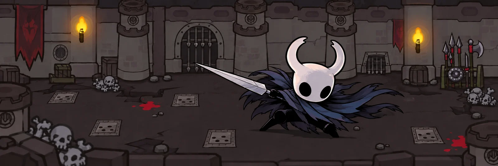
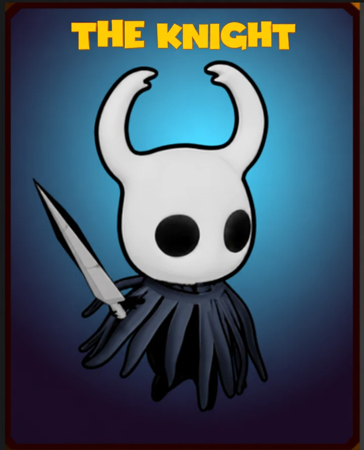

# DR Server



An independent, server-only compatibility implementation for **Dungeon
Rampage**, covering its HTTP services and multiplayer game socket.

[Watch the gameplay demo](https://www.youtube.com/watch?v=fa_nxNU_Jkw)

> [!IMPORTANT]
> This repository contains server code only. It does not distribute the client,
> game assets, or game data; supply those locally from a copy you are lawfully
> entitled to use. The project is unaffiliated with the original developer,
> publisher, and trademark owners. See [NOTICE.md](NOTICE.md).

## Highlights

- **Dungeon runtime:** generated and authored multi-floor maps, NPC AI, traps,
  triggers, rewards, trophy completion, and infinite runs.
- **Multiplayer:** public and private matches, parties, late joining, presence,
  matchmaking, and shared floor state.
- **Persistent accounts:** heroes, progression, inventory, skins, pets, chests,
  trading, and market listings.
- **Server authority:** combat pricing, movement containment, session checks,
  signed account tokens, and deterministic protocol validation.
- **Deployment options:** file or PostgreSQL storage, optional match workers,
  internal account API, diagnostics, and synthetic load testing.
- **Extensibility:** optional content packs can add skins, summons, and attack
  effects without changing server code.

## Quick start

### Requirements

- Node.js 20+
- a locally available compatible client installation or worktree
- JSON compatibility data imported into the ignored `local-data/` directory

Install dependencies, import the required data, and verify it:

```bash
npm install
npm run sync:data -- --source /path/to/your/client
npm run check:data
```

The importer copies only the files listed in `game-data/manifest.json`. Original
game data remains under ignored `local-data/` and is never part of the public
repository.

Start the server:

```bash
npm start
```

Default local services:

| Service | Address |
|---|---|
| HTTP compatibility service | `127.0.0.1:8080` |
| Game socket | `127.0.0.1:7198` |
| Account storage | ignored `data/` directory |
| Compatibility resources | ignored `local-data/Resources/` |

File storage is the default and requires no database. PostgreSQL is optional;
when `ODS_STORAGE=postgres` is selected, provide a compatible database or start
the bundled local container before the server:

```bash
npm run db:up
ODS_STORAGE=postgres npm start
```

Point a compatible client at `http://127.0.0.1:8080`. The executable and its
configuration are not part of this repository; see
[Client setup](docs/client-setup.md) for the required client-side keys.

## Hosting multiplayer

Remote players need both the HTTP service and game socket to be reachable, and
the server must advertise an address they can resolve:

```bash
ODS_HOST=0.0.0.0 ODS_PUBLIC_HOST=192.168.1.10 npm start
```

Player tokens cross both listeners, so putting TLS in front of HTTP alone is
not sufficient. Use a trusted VPN or tunnel when exposing the server beyond a
trusted LAN. See [Operations](docs/operations.md) for remote binding, player
tokens, the internal API, worker threads, storage ownership, and load testing.

## Custom skins (optional)

<p align="center">
  
</p>
<p align="center"><em>The Knight — an optional custom skin demonstrating the
content-pack compatibility layer. The skin and its source assets are not
distributed with this server.</em></p>

Content packs can add skins and their associated summons or attack effects.
Players without a pack can remain in the same match and receive the game's base
equivalents instead. No custom content is required to run the server.

See [Content packs](docs/content-packs.md) for the client bundle, GameMaster,
declaration, compatibility, and validation requirements.

## Development

Run the complete local conformance suite after importing compatibility data:

```bash
npm test
```

Useful focused checks:

```bash
npm run test:public          # fresh-clone suite; missing local data is skipped
npm run test:combat-matrix   # execute and audit authored NPC attacks
npm run audit:account-ids    # report persistent object-id collisions
npm run check:public         # audit the working tree and history for private data
```

See [Combat conformance](docs/combat-conformance.md) for the generated matrix
and remaining client-side boundary. Load-test scenarios and SLO gating are in
[Operations](docs/operations.md).

## Documentation

- [Client setup](docs/client-setup.md)
- [Operations and deployment](docs/operations.md)
- [Environment reference](.env.example)
- [Configuration data contracts](config/README.md)
- [Content packs](docs/content-packs.md)
- [Combat conformance](docs/combat-conformance.md)
- [Contributing](CONTRIBUTING.md)

## Contributing

Contributions are welcome. Read [CONTRIBUTING.md](CONTRIBUTING.md), open an
issue for a reproducible defect or proposal, or submit a focused pull request.

## License

DR Server is licensed under [GPL-3.0-or-later](LICENSE).
